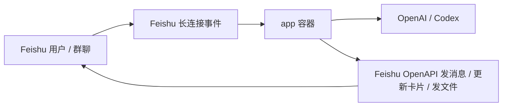

# Codex Feishu Bot

把“一键创建飞书机器人”这件事尽量交给用户自己的 Codex 自动完成。

这个仓库的主路径不是“用户自己看文档手点控制台”，而是：

1. 用户打开 Codex，模型切到 `GPT-5.4`，推理强度设成 `xhigh`
2. 用户把仓库地址贴给 Codex
3. Codex 按本仓库的 `README.md`、`AGENTS.md` 和 `docs/` 自己执行一键创建飞书机器人的脚本
4. 用户只在必须的时候介入：扫码登录 Feishu / OpenAI，或处理租户管理员审批

## 这套仓库能自动做什么

- 直接执行 `npx -y lark-op-cli@latest create-bot`
- 持续读取脚本输出，而不是等命令结束后再总结
- 如果出现扫码登录，把 ASCII 二维码原样转发给用户
- 在命令结束后汇总创建结果和下一步信息

默认情况下，运行时 `Codex` 看到的工作目录是当前仓库目录。这个创建路径不要求打开浏览器，也不要求用 `agent-browser` 或 Chrome CDP。

## 用户还需要做什么

只有这几类动作仍然属于用户：

- 扫码登录飞书
- 登录 OpenAI / Codex
- 处理 SSO、2FA 或租户管理员审批

不要把普通的开发者平台配置步骤推回给用户。

## 最短上手路径

### 1. 准备机器

建议环境：

- macOS 或 Linux
- Node.js 22+
- Codex Desktop 或可用的 Codex 会话

### 2. 让 Codex 接管

把这段 prompt 直接贴给 Codex：

```text
打开这个仓库后，严格按照 README.md、AGENTS.md、docs/codex-bootstrap-playbook.md 执行。不要打开浏览器，不要使用 agent-browser，不要做 Chrome CDP 自动化，也不要继续做 Docker 部署或飞书开放平台控制台配置。直接异步执行 `npx -y lark-op-cli@latest create-bot`，持续读取输出；如果过程中出现扫码登录，请把 ASCII 二维码原样转发给我。命令结束后，告诉我创建结果、关键标识、生成的配置和下一步。
```

同样的 prompt 也单独放在 [docs/codex-bootstrap-prompt.md](docs/codex-bootstrap-prompt.md)。

### 3. Codex 会执行的本地命令

```bash
npx -y lark-op-cli@latest create-bot
```

## 关键文档

- [AGENTS.md](AGENTS.md)：给 Codex 的仓库级操作约束
- [docs/codex-bootstrap-playbook.md](docs/codex-bootstrap-playbook.md)：Codex 的执行剧本
- [docs/open-source-scope.md](docs/open-source-scope.md)：v1 自动化边界

## 一键创建路径

这个仓库当前的 prompt 路径只要求执行一键创建飞书机器人的脚本，不要求打开浏览器。

推荐命令：

```bash
npx -y lark-op-cli@latest create-bot
```

执行要求：

- 持续读取 stdout / stderr
- 如果出现扫码登录，立即把 ASCII 二维码转发给用户
- 不打开浏览器
- 不调用 `agent-browser`

## Docker 运行架构

以下章节保留给仓库的其他开发/部署用途，不属于当前“一键创建飞书机器人” prompt 路径。



唯一的正式运行路径是单容器：

- `app`：同时包含 Node 服务和 `codex` CLI，由应用进程托管启动 `codex app-server`

对应命令：

```bash
pnpm docker:up
pnpm docker:logs
pnpm docker:smoke
pnpm docker:down
```

这个 compose 不会把整个仓库根目录挂到 `/workspace`。`/workspace` 是专门给 Codex 的运行工作目录。

## 环境变量

Codex 主要会写这个文件：

```bash
.env.real
```

先由仓库脚本生成：

```bash
pnpm bootstrap:env
```

然后由 Codex 自动补齐至少这些值：

- `FEISHU_APP_ID`
- `FEISHU_APP_SECRET`
- `CODEX_HOME_SOURCE` 或 `OPENAI_API_KEY`
- `CODEX_WORKSPACE_HOST_PATH`
- `CODEX_ARTIFACTS_DIR`
- `RUNTIME_STATE_FILE`

推荐优先让 Codex 检查宿主机是否已经存在 `~/.codex/auth.json`。如果存在，就把 `CODEX_HOME_SOURCE` 改成这个宿主机绝对路径；只有在本机没有 Codex 登录态时，才退回 `OPENAI_API_KEY`。

`.env.real.example` 里对每一项都有注释。

## 飞书目标状态

Codex 在飞书开放平台里最终应达到这个状态：

- 企业自建应用
- 已打开机器人能力
- 已切到长连接模式
- 已订阅 `im.message.receive_v1`
- 已补齐 IM 权限
- 已发布版本，测试租户可用

详细说明见 [docs/feishu-console-automation.md](docs/feishu-console-automation.md)。

## 验证

服务起来后：

```bash
pnpm docker:smoke
```

再去飞书里：

- 把机器人拉进一个群
- 群里直接发消息即可，不需要 `@`
- 或直接单聊机器人

如果自动化配置和部署都完成，机器人应能直接回消息、更新过程卡片、发送文件。

## 本地开发

本地代码开发仍可用：

```bash
cp .env.example .env
pnpm dev
```

但这条路径只适合写代码，不是推荐的集成验证路径。真实联调、验收和排查默认都走 Docker。

## Fake Feishu 联调

仓库仍保留 fake Feishu 环境，适合纯本地联调：

```bash
pnpm docker:fake:up
curl -X POST http://localhost:3400/fake/events/message \
  -H 'content-type: application/json' \
  -d '{
    "chatId": "oc_demo_docker",
    "messageId": "om_demo_docker_1",
    "text": "帮我总结一下当前 Docker 联调链路",
    "mentionsBot": true
  }'
curl http://localhost:3400/fake/state
```

## 注意事项

- `.env.real`、`.codex-local/` 都不要提交到 GitHub
- 用户可见导出文件默认会落到 `.codex-local/workspace/artifacts/`，这是预期行为，不是源码目录
- 运行时用户可见的文件必须通过飞书 API 发布，工作空间文件默认只有 Codex 自己可见
- 这套 prompt 默认不会打开浏览器，也不会调用 `agent-browser`
- 对外只有单容器部署，不再提供双容器 sidecar 运行模式

## License

MIT
