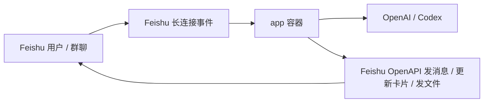

# Codex Feishu Bot

把 `codex app-server` 接到飞书群聊，并把“创建飞书应用、开事件订阅、补权限、发布版本、Docker 部署”这整套流程尽量交给用户自己的 Codex 自动完成。

这个仓库的主路径不是“用户自己看文档手点控制台”，而是：

1. 用户打开 Codex，模型切到 `GPT-5.4`，推理强度设成 `xhigh`
2. 用户把仓库地址贴给 Codex
3. Codex 按本仓库的 `README.md`、`AGENTS.md` 和 `docs/` 自己完成环境准备、浏览器自动化和部署
4. 用户只在必须的时候介入：登录 Feishu / OpenAI，或处理租户管理员审批

## 这套仓库能自动做什么

- 用 Chrome DevTools Protocol 启动一个专用浏览器实例
- 让 Codex 通过浏览器自动化操作飞书开放平台
- 创建或复用一个企业自建应用
- 打开机器人能力
- 切到飞书长连接模式
- 订阅 `im.message.receive_v1`
- 补齐 IM 相关权限
- 发布版本
- 把 `FEISHU_APP_ID` / `FEISHU_APP_SECRET` 写回 `.env.real`
- 用 Docker 起单个 `app` 服务
- 跑健康检查和 smoke check

默认情况下，运行时 `Codex` 看到的工作目录是单独挂载的 `/workspace`，不是这个仓库本身。给用户的导出文件会写到这个运行时工作目录下的 `artifacts/`，宿主机默认对应 `.codex-local/workspace/artifacts/`。
聊天运行态快照也会写到工作目录下的 `.codex-feishu-bot/runtime-state.json`，因此容器重启后仍能保留 `chat -> thread` 映射和最近消息投影；但重启前未完成的 run 会被标记为已中断，不会继续占着 active turn。服务重启完成后，机器人会自动在受影响的群里发一条提示，告诉用户可以直接回复“继续”。

## 用户还需要做什么

只有这几类动作仍然属于用户：

- 登录飞书开放平台
- 登录 OpenAI / Codex
- 处理 SSO、2FA 或租户管理员审批

不要把普通的开发者平台配置步骤推回给用户。

## 最短上手路径

### 1. 准备机器

建议环境：

- macOS 或 Linux
- Docker / OrbStack
- Node.js 22+
- `pnpm`
- Google Chrome
- Codex Desktop 或可用的 Codex 会话

### 2. 让 Codex 接管

把这段 prompt 直接贴给 Codex：

```text
打开这个仓库后，严格按照 README.md、AGENTS.md、docs/codex-bootstrap-playbook.md、docs/feishu-console-automation.md 执行。优先走 Docker，不要把普通的控制台配置步骤推回给我。先运行 pnpm install、pnpm bootstrap:env、pnpm chrome:debug；如果我没登录飞书开放平台或 OpenAI/Codex，再停下来让我登录。登录完成后，先检查是否已经有合适的飞书应用或机器人可复用；如果有，就直接复用并继续后续配置。只有在没有合适对象可复用时，才异步执行 `npx -y lark-op-cli@latest create-bot --name "Codex 机器人"` 并持续读取输出；如果过程中出现扫码登录，请把 ASCII 二维码原样转发给我。拿到 FEISHU_APP_ID 和 FEISHU_APP_SECRET 后写回 .env.real，然后用 Docker 启动并验证服务，最后告诉我怎么在飞书里测试。
```

同样的 prompt 也单独放在 [docs/codex-bootstrap-prompt.md](docs/codex-bootstrap-prompt.md)。

### 3. Codex 会执行的本地命令

```bash
pnpm install
pnpm bootstrap:env
pnpm chrome:debug
pnpm docker:up
pnpm docker:smoke
```

## 关键文档

- [AGENTS.md](AGENTS.md)：给 Codex 的仓库级操作约束
- [docs/codex-bootstrap-playbook.md](docs/codex-bootstrap-playbook.md)：Codex 的执行剧本
- [docs/feishu-console-automation.md](docs/feishu-console-automation.md)：飞书开放平台需要达到的目标状态
- [docs/open-source-scope.md](docs/open-source-scope.md)：v1 自动化边界

## 浏览器自动化路径

这个仓库默认把“飞书开发者平台配置”视为浏览器自动化任务，而不是应用运行时的一部分。

推荐做法：

```bash
pnpm chrome:debug
```

这会启动一个专用的 Chrome 调试实例，并暴露本地 CDP 端口。之后 Codex 可以通过任意可用的浏览器自动化能力接管这个浏览器；如果机器上装了 `agent-browser`，典型命令是：

```bash
agent-browser --cdp 9222 open https://open.feishu.cn/app
```

如果 `agent-browser` 不在机器上，Codex 也可以用任何可用的 CDP/DevTools 能力，只要它真的去操作浏览器，而不是让用户手动点一遍。

## Docker 运行架构



唯一的正式运行路径是单容器：

- `app`：同时包含 Node 服务和 `codex` CLI，由应用进程托管启动 `codex app-server`

对应命令：

```bash
pnpm docker:up
pnpm docker:logs
pnpm docker:smoke
pnpm docker:down
```

这个 compose 不会把整个仓库根目录挂到 `/workspace`。`/workspace` 是专门给 Codex 的运行工作目录。

## 环境变量

Codex 主要会写这个文件：

```bash
.env.real
```

先由仓库脚本生成：

```bash
pnpm bootstrap:env
```

然后由 Codex 自动补齐至少这些值：

- `FEISHU_APP_ID`
- `FEISHU_APP_SECRET`
- `CODEX_HOME_SOURCE` 或 `OPENAI_API_KEY`
- `CODEX_WORKSPACE_HOST_PATH`
- `CODEX_ARTIFACTS_DIR`
- `RUNTIME_STATE_FILE`

推荐优先让 Codex 检查宿主机是否已经存在 `~/.codex/auth.json`。如果存在，就把 `CODEX_HOME_SOURCE` 改成这个宿主机绝对路径；只有在本机没有 Codex 登录态时，才退回 `OPENAI_API_KEY`。

`.env.real.example` 里对每一项都有注释。

## 飞书目标状态

Codex 在飞书开放平台里最终应达到这个状态：

- 企业自建应用
- 已打开机器人能力
- 已切到长连接模式
- 已订阅 `im.message.receive_v1`
- 已补齐 IM 权限
- 已发布版本，测试租户可用

详细说明见 [docs/feishu-console-automation.md](docs/feishu-console-automation.md)。

## 验证

服务起来后：

```bash
pnpm docker:smoke
```

再去飞书里：

- 把机器人拉进一个群
- 群里直接发消息即可，不需要 `@`
- 或直接单聊机器人

如果自动化配置和部署都完成，机器人应能直接回消息、更新过程卡片、发送文件。

## 本地开发

本地代码开发仍可用：

```bash
cp .env.example .env
pnpm dev
```

但这条路径只适合写代码，不是推荐的集成验证路径。真实联调、验收和排查默认都走 Docker。

## Fake Feishu 联调

仓库仍保留 fake Feishu 环境，适合纯本地联调：

```bash
pnpm docker:fake:up
curl -X POST http://localhost:3400/fake/events/message \
  -H 'content-type: application/json' \
  -d '{
    "chatId": "oc_demo_docker",
    "messageId": "om_demo_docker_1",
    "text": "帮我总结一下当前 Docker 联调链路",
    "mentionsBot": true
  }'
curl http://localhost:3400/fake/state
```

## 注意事项

- `.env.real`、本地 Chrome profile、`.codex-local/` 都不要提交到 GitHub
- 用户可见导出文件默认会落到 `.codex-local/workspace/artifacts/`，这是预期行为，不是源码目录
- 运行时用户可见的文件必须通过飞书 API 发布，工作空间文件默认只有 Codex 自己可见
- 这套仓库默认不会为用户申请不存在的“飞书开发者平台管理 API”；平台配置路径是浏览器自动化
- 对外只有单容器部署，不再提供双容器 sidecar 运行模式

## License

MIT
